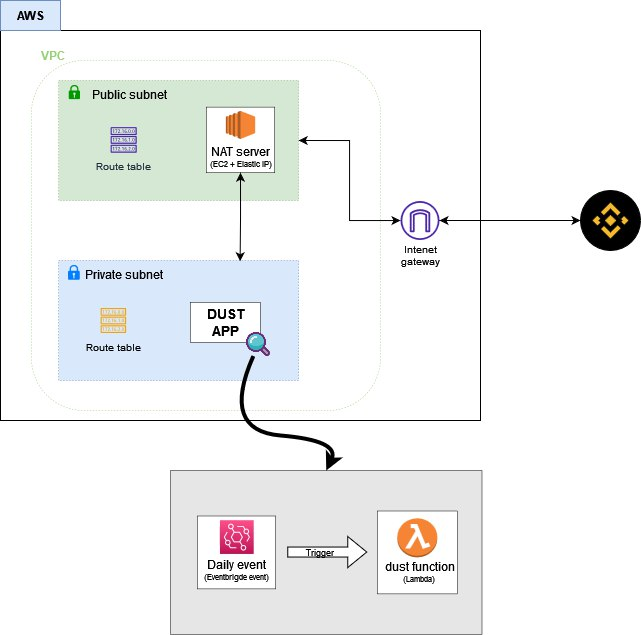

# dust-converter
Converts automatically dust balances into BNB in a Binance account.

## Why?
It is intended to convert at regular intervals of time, any dust balance into BNB. Small `staking` investments or `earn` investments deposits dust balances into the spot wallet in a daily basis, one use case can be turn those balance into BNB and leverage interest offered by others BNB invesments products.

## How?

The general idea is to take advantage of cloud infrastructure. The following diagram explain how this would looks like in an AWS enviroment, for more details about implementation go to [Infrastructure Implementation](./docs/infra-details.md).

